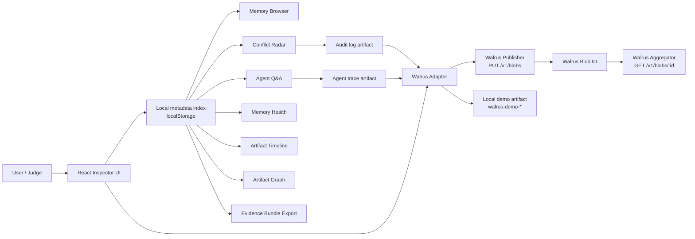
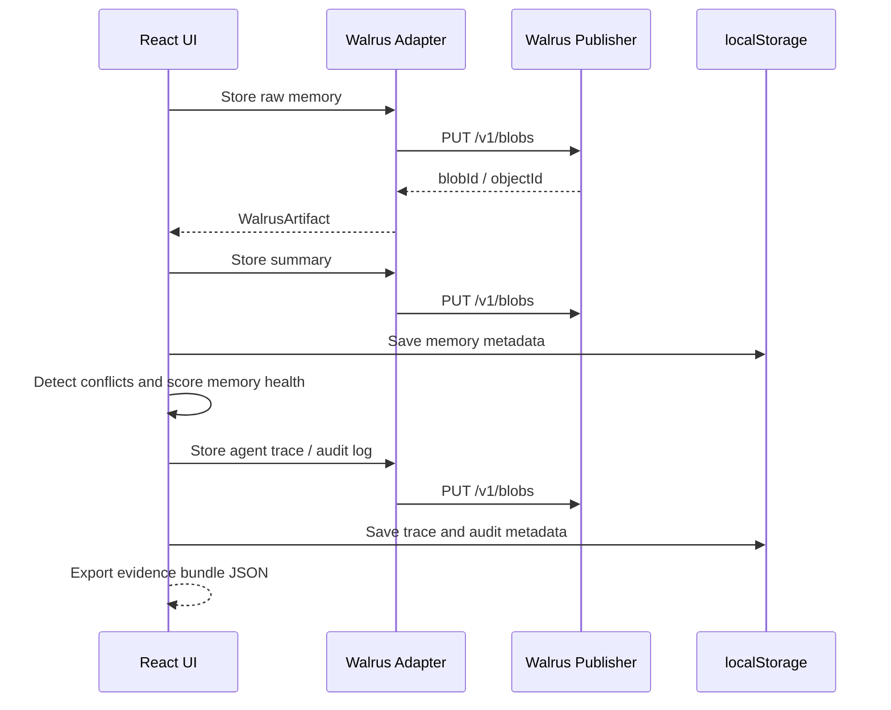

# Architecture

Walrus Memory Inspector is a browser-only MVP. The browser keeps metadata in `localStorage` and writes durable artifacts through the Walrus HTTP publisher when available.

## System Diagram

## Artifact Chain

## Core Boundaries

- `src/main.tsx`: UI workflows and state transitions.
- `src/walrusAdapter.ts`: artifact storage boundary, timeout, diagnostics, and fallback.
- `src/agent.ts`: explainable retrieval, answer generation, and trace artifact creation.
- `src/conflicts.ts`: transparent conflict rules.
- `src/inspector.ts`: derived views for health, timeline, graph, diagnostics, and evidence bundles.
- `src/storage.ts`: local metadata persistence and migration.

## Backend Decision

The default Walrus testnet browser-direct path was verified on 2026-06-15. A backend proxy is not required for the current MVP.

Add a backend proxy only if:

- The judging publisher endpoint requires private credentials.
- Browser CORS behavior changes or blocks upload.
- Uploads repeatedly exceed the configured timeout.
- Metadata needs to be shared across users, devices, or browsers.
